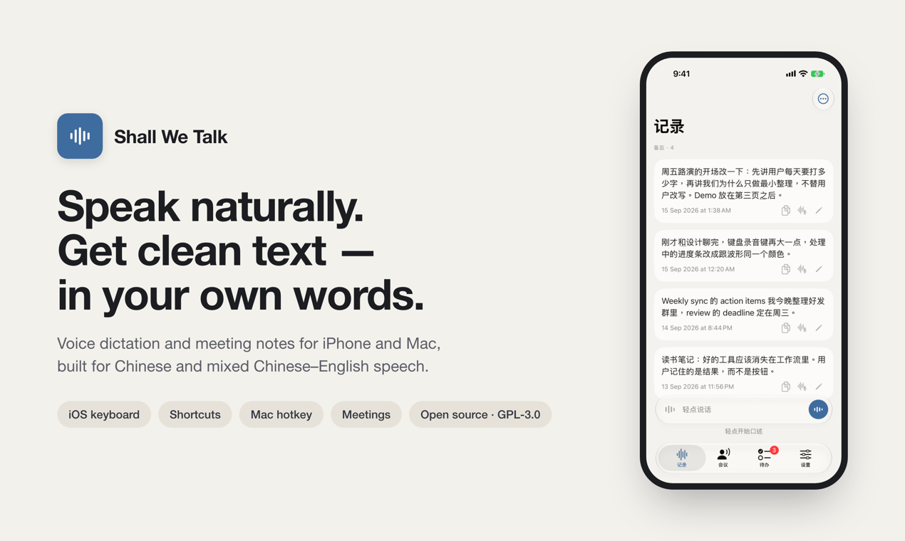

# Shall We Talk



**Speak naturally, get clean text in your own words.** Dictate into any app with an iPhone keyboard, Shortcuts or a Mac hotkey, and record meetings into speaker-labeled transcripts and summaries. Cleanup removes fillers and misheard words without rewriting how you talk. [See it on Product Hunt](https://www.producthunt.com/products/shall-we-talk).

Native voice dictation and meeting recording for iOS and macOS, with a shared Swift core. Chinese-language workflows are a primary focus.

This is a **sanitized, open-source development repository**. It does not include a hosted backend, API credentials, signing identities, private deployment details, user recordings, or the original private Git history. New installations default to direct API configuration. You must supply your own provider account and implement a secure configuration path for your build; the current connection screen exposes route selection rather than provider credential entry. See the configuration guide.

## Features

- iOS custom keyboard with full-pinyin, T9 and initials lookup; request-bound voice text delivery.
- iOS Shortcuts: background dictation returns text for a conditional Copy to Clipboard action; meeting shortcut starts or stops the current meeting and opens the meeting UI.
- Meeting audio capture, interruption handling, persisted audio, transcription and summary workflows.
- macOS hotkey dictation, focused-field insertion and clipboard fallback.
- Shared provider clients, cleanup policies, local Silero VAD, storage and regression tests.

## Build

Use macOS with full Xcode 26 or newer and XcodeGen and ripgrep (`brew install xcodegen ripgrep`). The main iOS app targets iOS 18 or newer; the shared package supports iOS 16/macOS 14. Some features require newer OS versions.

```sh
git clone https://github.com/joblesshk/shall-we-talk.git
cd shall-we-talk
./scripts/bootstrap.sh
./scripts/verify.sh
```

`verify.sh` runs source policy, unit/smoke checks and unsigned iOS Simulator/macOS builds. Live provider tests require explicitly configured credentials and test audio; skips are not live acceptance.

For device builds, configure your own development team and unique bundle/App Group/iCloud identifiers in `ios/project.yml`, `macos/project.yml`, and their entitlements, then regenerate the projects. `YOURTEAMID` and `org.example` are placeholders. Never commit signing material. See [Configuration](docs/CONFIGURATION.md).

## Documentation

- [Architecture](docs/ARCHITECTURE.md)
- [Configuration and permissions](docs/CONFIGURATION.md)
- [Shortcuts](docs/SHORTCUTS.md)
- [Testing and release](docs/TESTING.md)
- [Privacy](PRIVACY.md) and [security reporting](SECURITY.md)
- [Contribution guide](CONTRIBUTING.md) and [repository policy](REPOSITORY_POLICY.md)
- [Third-party notices](THIRD_PARTY_NOTICES.md), [references](ACKNOWLEDGMENTS.md), and [changelog](CHANGELOG.md)
- [Publication boundary](docs/PUBLICATION.md)

## License and status

Original application code is licensed under **GNU GPL v3.0 only (GPL-3.0-only)**. You may use, modify and redistribute it, including commercially, under that license. Distribution of covered modified versions must preserve GPL freedoms and provide the required corresponding source. See [LICENSE](LICENSE), [copyright and scope](COPYRIGHT), and the [licensing guide](docs/LICENSING.md). Third-party components retain their own licenses and notices. The GPL-3.0-only Rime Ice resources and their corresponding-source archive remain included; see [THIRD_PARTY_NOTICES.md](THIRD_PARTY_NOTICES.md).

This repository is a development snapshot, not an App Store release or a guarantee of cross-app insertion. On iOS, another keyboard cannot provide this app with its document proxy; use the system shortcut clipboard flow and paste manually. Meeting toggle opens the app. Real device microphone, background lifecycle, permissions and insertion must be tested separately.
